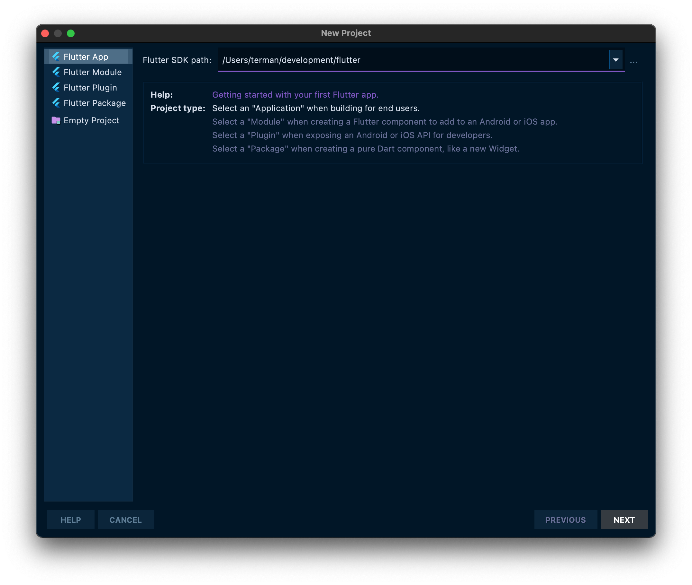
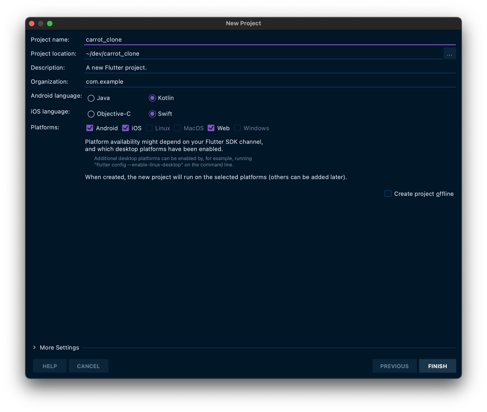

# 1. Flutter 환경변수 설정
플러터 환경변수 영구 설정이 안 됐을 시에는 아래 링크 참고  
[윈도우 환경변수 설정](https://devlopsquare.tistory.com/3)  
[MAC 환경변수 설정](https://blog.naver.com/bluecrossing/222277992718)

# 2. Flutter 당근마켓 UI 클론 코딩 무작정 따라하기
[전체 코드](https://github.com/Ohgyuchan/carrot_clone)

## 2.1. 프로젝트 생성
* `Create New Flutter Project` 클릭

* 바로 `NEXT` 클릭

* `carrot_clone` 으로 프로젝트 이름 설정

* `lib/` 에 다음 네가지 디렉토리 생성
  * `components`
  * `repositories`
  * `screens`
  * `utils`

    

* 데이터 다운로드
  1. [data 다운로드](https://drive.google.com/file/d/1BptUxZB6FyyCk5w0WWGE0INJX7E53mV9/view?usp=sharing)
  2. 압축파일에 있는 `assets`를 `carrot_clone/` 에 assets 가져오기

  3. `lib/repository` 에 다운로드한 데이터 집어넣기
    * `carrot_clone
    * carrot_clone_data/repository/*`
    ```
    $ flutter pub add flutter_secure_storage
    $ flutter pub get
    ```
    * `android minSDK version` 18로 변경
    flutter_secure_storage를 쓰려면 android sdk version이 최소 18이어야 된다.
    
    * `android/app/buile.gradle` 에서 `minSkdVersion` 수정
    ```
    ...
    defaultConfig {
        // TODO: Specify your own unique Application ID (https://developer.android.com/studio/build/application-id.html).
        applicationId "com.example.carrot_clone"
        minSdkVersion 18 // Update
        targetSdkVersion 30
        versionCode flutterVersionCode.toInteger()
        versionName flutterVersionName
    }
    ...
    ```
### 2.1.1. assets 적용하기
`pubspec.yaml`
> **Indentation** 주의
```
// 변경 전
 # To add assets to your application, add an assets section, like this:
  # assets:
  #   - images/a_dot_burr.jpeg
  #   - images/a_dot_ham.jpeg

// 변경 후
  # To add assets to your application, add an assets section, like this:
  assets:
    - assets/svg/
    - assets/images/
```
```
$ flutter pub get
```
## 2.2. BottomNavigationBar 만들기
`carrot_clone/main.dart` 을 아래 내용으로 변경
```dart
import 'package:flutter/material.dart';

void main() {
  runApp(MyApp());
}

class MyApp extends StatelessWidget {
  
  @override
  Widget build(BuildContext context) {
    return MaterialApp(
      title: 'Carrot Clone',
      theme: ThemeData(
        primaryColor: Colors.white,
        primarySwatch: Colors.blue,
      ),
      home: Scaffold(),
    );
  }
}
```
### 2.2.1 패키지 사용하기
[패키지 설명](https://pub.dev/packages/flutter_svg)
* 패키지 다운로드
   * 방법1: 아래 명령어를 터미널에 입력.
        ```
        $ flutter pub add flutter_svg
        ```
   * 방법2: `pubspec.yaml` 에서, NEW 주석이 달린 부분을 복붙
       ```
       dependencies:
       flutter:
           sdk: flutter
       
       flutter_svg: ^0.22.0 # NEW
       ```
   * pubspec.yaml 업데이트 적용
       ```
       $ flutter pub get
       ```
* 패키지 사용
   * `carrot_clone/main.dart`
    ```
    import 'package:flutter/material.dart';
    import 'package:flutter_svg/flutter_svg.dart'; // NEW

    void main() {
        runApp(MyApp());
    }
    ...
    ```
### 2.2.2. BottomNavigation 만들기
* AppBar 추가
    
    `carrot_clone/lib/main`
    ```dart
    Widget build(BuildContext context) {
        return MaterialApp(
        title: 'Carrot Clone',
        theme: ThemeData(
            primaryColor: Colors.white,
            primarySwatch: Colors.blue,
        ),
        home: Scaffold(
            appBar: AppBar(     // 여기부터
            title: Row(
                children: [
                Text('양덕동'),
                Icon(Icons.arrow_drop_down),
                ],
            ),
            ),
        ),                    // 여기까지
        );
    }
    ```
* bottomNavigationBar 옵션 추가  
    `Scaffold` 위젯에 `bottomNavigationBar` 옵션을 이용합니다.
    `carrot_clone/lib/main` 
    `MyApp -> build() -> Scaffold`
    ```dart
    home: Scaffold(
        appBar: AppBar(
          title: Row(
            children: [
              Text('양덕동'),
              Icon(Icons.arrow_drop_down),
            ],
          ),
        ),
        // 여기부터
        Center(
          child: Text('body'),
        ),
        bottomNavigationBar: Container(
          height: 50,
          color: Colors.red,
        ),
        // 여기까지
      ),
    ```
    
### 2.2.3. BottomNavigationBar 위젯 쓰기
`carrot_clone/lib/main.dart -> Scaffold(:bottomNavigationBar)` 에서 `Container` 위젯을 `BottomNavigationBar` 로 변경 
```dart
body: Center(
          child: Text('body'),
        ),
        // 여기부터
        bottomNavigationBar: BottomNavigationBar(
          type: BottomNavigationBarType.fixed,
          items: [
            BottomNavigationBarItem(
              icon: Padding(
                padding: const EdgeInsets.only(bottom: 5.0),
                child: SvgPicture.asset(
                  "assets/svg/home_off.svg",
                  width: 22,
                ),
              ),
              label: '홈',
            ),
            BottomNavigationBarItem(
              icon: Padding(
                padding: const EdgeInsets.only(bottom: 5.0),
                child: SvgPicture.asset(
                  "assets/svg/notes_off.svg",
                  width: 22,
                ),
              ),
              label: '동네 생활',
            ),
            BottomNavigationBarItem(
              icon: Padding(
                padding: const EdgeInsets.only(bottom: 5.0),
                child: SvgPicture.asset(
                  "assets/svg/location_off.svg",
                  width: 22,
                ),
              ),
              label: '내 근처',
            ),
            BottomNavigationBarItem(
              icon: Padding(
                padding: const EdgeInsets.only(bottom: 5.0),
                child: SvgPicture.asset(
                  "assets/svg/chat_off.svg",
                  width: 22,
                ),
              ),
              label: '채팅',
            ),
            BottomNavigationBarItem(
              icon: Padding(
                padding: const EdgeInsets.only(bottom: 5.0),
                child: SvgPicture.asset(
                  "assets/svg/user_off.svg",
                  width: 22,
                ),
              ),
              label: '나의 당근',
            ),
          ],
        ),
        // 여기까지
```


## 2.3. App Screen 만들기
프로젝트를 관리할 때 기능별로 혹은 화면(Screen)별로 *.dart 파일을 나누어 관리하는 것이 효율적입니다.  

main.dart는 앱을 시작하는 부분만을 담당하게 하고, Bottom Navigation을 포함한 화면을 전환해주는 기능을 담당하는 `AppScreen Class`를 `/lib/screens/app_screen.dart`에 따로 정의해 줍니다.  

> 앞으로 다룰 Screen들도 각 Screen 별로 dart 파일을 만들어 관리하도록 하겠습니다.

### 2.3.1. AppScreen 만들기
프로그래밍을 할 때 동일한 코드가 여러 곳에서 동시에 써야하는 일이 있습니다.

이런 경우에는 반복되는 코드를 함수나 클래스로 정의해서 관리하는 것이 유지, 보수에 효율적입니다.  

위에서는 `BottomNavigationBarItem` 위젯이 반복되기 때문에 따로 함수로 만들어 `app_screen.dart` 에 재정의 합니다.

`/lib/screens/app_screen.dart`
> `AppScreen` 클래스를 StatefulWidget으로 다음과 같이 정의합니다.
```dart
import 'package:flutter/material.dart';
import 'package:flutter_svg/flutter_svg.dart';

class AppScreen extends StatefulWidget {
  const AppScreen({Key? key}) : super(key: key);

  @override
  _AppState createState() => _AppState();
}

class _AppState extends State<AppScreen> {
  late int _currentPageIndex;

  @override
  void initState() {
    super.initState();
    _currentPageIndex = 0;
  }

  @override
  Widget build(BuildContext context) {
    return Scaffold(
      body: _bodyWidget(),
      bottomNavigationBar: _bottomNavigationBarWidget(),
    );
  }

  Widget _bodyWidget() {
    switch (_currentPageIndex) {
      case 0: // 홈
        return Center(
          child: Text('홈'),
        );
      case 1: // 동네 생활
        return Center(
          child: Text('동네 생활'),
        );
      case 2: // 내 근처
        return Center(
          child: Text('내 근처'),
        );
      case 3: // 채팅
        return Center(
          child: Text('채팅'),
        );
      case 4: // 나의 당근
        return Center(
          child: Text('나의 당근'),
        );
    }
    return Container();
  }

  BottomNavigationBarItem _bottomNavigationBarItem(
      String iconName, String label) {
    return BottomNavigationBarItem(
      icon: Padding(
        padding: const EdgeInsets.only(bottom: 5.0),
        child: SvgPicture.asset(
          "assets/svg/${iconName}_off.svg",
          width: 22,
        ),
      ),
      activeIcon: Padding(
        padding: const EdgeInsets.only(bottom: 5.0),
        child: SvgPicture.asset(
          "assets/svg/${iconName}_on.svg",
          width: 22,
        ),
      ),
      label: label,
    );
  }

  Widget _bottomNavigationBarWidget() {
    return BottomNavigationBar(
      type: BottomNavigationBarType.fixed,
      onTap: (int index) {
        print(index);
        setState(() {
          _currentPageIndex = index;
        });
      },
      currentIndex: _currentPageIndex,
      selectedFontSize: 12,
      selectedItemColor: Colors.black,
      selectedLabelStyle: TextStyle(color: Colors.black),
      items: [
        _bottomNavigationBarItem("home", "홈"),
        _bottomNavigationBarItem("notes", "동네 생활"),
        _bottomNavigationBarItem("location", "내 근처"),
        _bottomNavigationBarItem("chat", "채팅"),
        _bottomNavigationBarItem("user", "나의 당근"),
      ],
    );
  }
}

```
> `_bottomNavigationBarWidget` : BottomNavigationBar를 `return` 하는 함수

> `selectedFontSize`, `selectedItemColor`, 
`selectedLavelStyle` 옵션을 추가해서 선택된 `BottomNavigationBarItem` 에 효과를 줍니다.

```dart
Widget _bottomNavigationBarWidget() {
    return BottomNavigationBar(
      type: BottomNavigationBarType.,
      onTap: (int index) {
        print(index);
        setState(() {
          _currentPageIndex = index;
        });
      },
      currentIndex: _currentPageIndex,
      selectedFontSize: 12,
      selectedItemColor: Colors.black,
      selectedLabelStyle: TextStyle(color: Colors.black),
      items: [
        _bottomNavigationBarItem("home", "홈"),
        _bottomNavigationBarItem("notes", "동네 생활"),
        _bottomNavigationBarItem("location", "내 근처"),
        _bottomNavigationBarItem("chat", "채팅"),
        _bottomNavigationBarItem("user", "나의 당근"),
      ],
    );
  }
```

* main.dart  
    `/lib/main.dart`
    ```dart
    import 'package:carrot_clone/screens/app_screen.dart';
    import 'package:flutter/material.dart';

    void main() {
        runApp(MyApp());
    }

    class MyApp extends StatelessWidget {
        @override
        Widget build(BuildContext context) {
            return MaterialApp(
            title: 'Carrot Clone',
            theme: ThemeData(
                primaryColor: Colors.white,
                primarySwatch: Colors.blue,
            ),
            home: AppScreen(),
            );
        }
    }

    ```
    
## 2.4. Home Screen 만들기
### 2.4.1. intl pakage 사용하기
```
$ flutter pub add intl
$ flutter pub get
```
### 2.4.2. DataUtils Class 생성
`/lib/utils/data_utils.dart` 에 아래 내용 복붙
```dart
import 'package:intl/intl.dart';

class DataUtils {
  static final formatToWon = new NumberFormat("#,###", "ko_KR");
  static String calcStringToWon(String priceString) {
    if (priceString == '무료나눔') return priceString;
    return "${oCcy.format(int.parse(priceString))}원";
  }
}
```

`/lib/screens/app_screen.dart` `AppScreen -> _bodyWidget()` 수정
```dart
Widget _bodyWidget() {
    switch (_currentPageIndex) {
      case 0: // 홈
        return HomeScreen();
      case 1: // 동네 생활
        return Center(
          child: Text('동네 생활'),
        );
      case 2: // 내 근처
        return Center(
          child: Text('내 근처'),
        );
      case 3: // 채팅
        return Center(
          child: Text('채팅'),
        );
      case 4: // 나의 당근
        return Center(
          child: Text('나의 당근'),
        );
    }
    return Container();
  }
```
## 2.5. ListView 만들기
## 2.6. Home Screen - AppBar 수정
## 2.7. Detail Screen 만들기
## 2.8. Detail Screen - BottomBar 수정
## 2.9. Detail Screen - AppBar 수정

[Youtube 영상 자료](https://www.youtube.com/playlist?list=PLW-3bp81vhrdNVs2sNP51LY9C5RJw3cJI)
